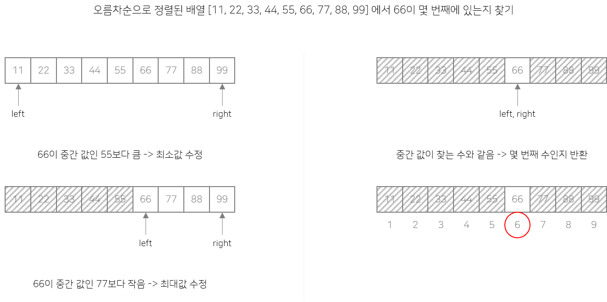

# Binary Search (이진 탐색)

이진 탐색은 오름차순으로 정렬된 리스트에서 특정한 값의 위치를 찾는 알고리즘이다. 처음 중간의 값을 임의의 값으로 선택하여, 그 값과 찾고자 하는 값의 크고 작음을 비교하는 방식을 채택하고 있다. 처음 선택한 중앙값이 만약 찾는 값보다 크면 그 값은 새로운 최대값이 되며, 작으면 그 값은 새로운 최소값이 된다.

### 장점

1. 속도가 빠르다.

### 단점

1. 정렬된 리스트에서만 사용할 수 있다.


## 예시




## C++ 코드

```c++
int binarySearch(int A[], int low, int high, int target) {
	while (low <= high) {
		int mid = (low + high) / 2;

		if (A[mid] == target) return mid;
		else if (A[mid] > target) high = mid - 1;
		else low = mid + 1;
	}

	return -1;
}
```
